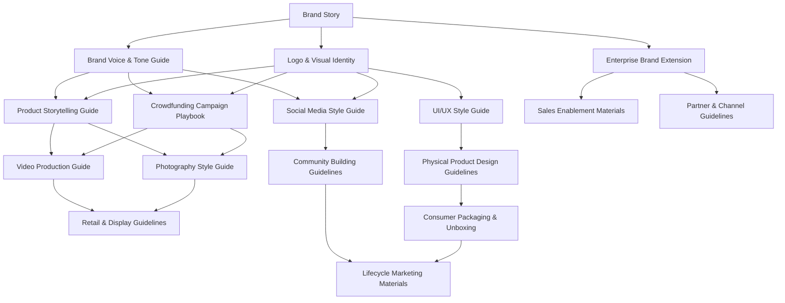

# HeyZack Branding Documents Roadmap

This document outlines all branding documents needed for both B2B and B2C aspects of the HeyZack project, organized by priority and implementation timeline.

## Core Brand Documents (Immediate Priority)

- [x] **Brand Story**
  - Core narrative and positioning
  - Elevator pitches (5-second, 30-second, 2-minute)
  - Market fit analysis
  - Product positioning statements
  - Brand values and promises

- [ ] **Logo & Visual Identity**
  - Logo design (primary, secondary, and icon versions)
  - Color palette with usage guidelines
  - Typography system and hierarchy
  - Visual elements and patterns
  - Grid system and layouts

- [ ] **Brand Voice & Tone Guide**
  - Writing principles and personality
  - Vocabulary and terminology standards
  - Technical concept simplification examples
  - Voice examples for different touchpoints
  - Readability standards and testing

## Crowdfunding Campaign Documents (High Priority)

- [ ] **Crowdfunding Campaign Playbook**
  - Campaign page structure and visual hierarchy
  - Backer reward tier strategies and presentation
  - Campaign messaging framework
  - FAQ and objection handling
  - Updates and communication schedule

- [ ] **Product Storytelling Guide**
  - Feature-to-benefit translation frameworks
  - Use case scenarios and storytelling templates
  - Technical simplification guidelines
  - Comparison strategies (vs. competitors)
  - "Before and after" narrative structures

- [ ] **Social Media Style Guide**
  - Platform-specific content strategies
  - Visual templates for campaign promotion
  - Hashtag and keyword strategy
  - Community engagement guidelines
  - Influencer collaboration frameworks

## Visual Asset Documents (Medium Priority)

- [ ] **Photography Style Guide**
  - Product photography specifications
  - In-home environmental shooting guidance
  - Lighting and color grading standards
  - Composition templates for various uses
  - Photo editing and processing guidelines

- [ ] **Video Production Guide**
  - Demo video specifications
  - Testimonial and use case video frameworks
  - Animation style guidelines
  - Script templates and tone guidance
  - Technical specifications for various platforms

- [ ] **UI/UX Style Guide**
  - Interface design principles
  - Component library
  - Interaction patterns
  - Accessibility standards
  - Responsive design guidelines

## Product & Packaging Documents (Lower Priority)

- [ ] **Physical Product Design Guidelines**
  - IoT kit hardware specifications
  - Packaging design principles
  - Unboxing experience design
  - Installation materials design
  - Product evolution planning

- [ ] **Retail & Display Guidelines**
  - Point-of-sale materials
  - Retail display specifications
  - Demo station requirements
  - Partner co-branding guidelines
  - Retail staff training materials

## B2B-Specific Documents

- [ ] **Enterprise Brand Extension**
  - B2B positioning and messaging
  - Enterprise value propositions
  - Technical credibility elements
  - Industry-specific adaptations
  - Case study frameworks

- [ ] **Sales Enablement Materials**
  - Presentation templates
  - Product specification sheets
  - Comparison guides
  - ROI calculators
  - Implementation roadmaps

- [ ] **Partner & Channel Guidelines**
  - Co-branding specifications
  - Channel marketing materials
  - Certification program branding
  - Partner portal design
  - Joint marketing campaign guidelines

## B2C-Specific Documents

- [ ] **Consumer Packaging & Unboxing**
  - Retail packaging design
  - Unboxing experience flow
  - Quick-start guide design
  - Registration card/digital onboarding
  - Warranty and support materials

- [ ] **Community Building Guidelines**
  - User forum design
  - User-generated content guidelines
  - Ambassador program branding
  - Event and meetup materials
  - Support community design

- [ ] **Lifecycle Marketing Materials**
  - Onboarding sequence design
  - Feature announcement templates
  - Upgrade path visualization
  - Loyalty program branding
  - Referral program materials

## Implementation Timeline

### Phase 1: Foundation (Immediate)
- Complete Brand Story ✓
- Develop Logo & Visual Identity
- Create Brand Voice & Tone Guide

### Phase 2: Crowdfunding Preparation (1-2 Months)
- Develop Crowdfunding Campaign Playbook
- Create Product Storytelling Guide
- Establish Social Media Style Guide

### Phase 3: Visual Asset Development (2-3 Months)
- Produce Photography Style Guide
- Develop Video Production Guide
- Design UI/UX Style Guide

### Phase 4: Product Launch Preparation (3-6 Months)
- Finalize Physical Product Design Guidelines
- Create Retail & Display Guidelines
- Develop appropriate B2B and B2C specific documents based on go-to-market strategy

## Document Dependencies

## Responsible Teams

- **Brand Team:** Core brand documents, voice & tone
- **Design Team:** Visual identity, UI/UX, product design
- **Marketing Team:** Crowdfunding, social media, lifecycle marketing
- **Product Team:** Product storytelling, physical product guidelines
- **Sales Team:** B2B documents, sales enablement, partner guidelines

## Review Cadence

- **Weekly:** Documents in active development
- **Bi-weekly:** Cross-functional review of completed documents
- **Monthly:** Full brand document audit and alignment check
- **Quarterly:** Comprehensive brand consistency review

This roadmap should be treated as a living document, updated as the project evolves and market feedback is incorporated.
