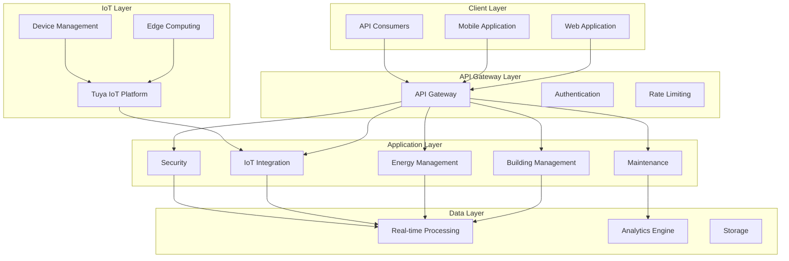
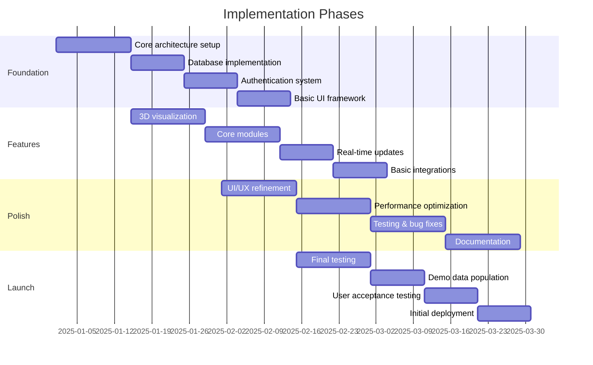

# HeyZack Building Management Solution

*Next-Generation Building Management Solution for the French Market*

[Documentation](./1_Executive_Overview.md) | [System Architecture](./2_System_Architecture.md) | [Core Features](./3_Core_Features_Modules.md) | [Implementation](./10_Implementation_Deployment.md)

## Executive Summary

HeyZack BMS is a comprehensive IoT-integrated Building Management Solution designed specifically for the French market. Our platform revolutionizes how commercial buildings are managed, delivering:

- **30% Energy Savings** through AI-driven optimization
- **45% Faster** anomaly detection than traditional systems
- **93% Accuracy** in maintenance prediction
- **40% Higher** CEE credits through AI optimization
- **25% Reduction** in operational costs

### Key Market Differentiators

| Feature | HeyZack BMS | Traditional Solutions |
|---------|-------------|----------------------|
| Anomaly Detection | 45% faster | Industry standard |
| Maintenance Prediction | 93% accuracy | 76% accuracy |
| False Alert Reduction | 87% reduction | Manual filtering |
| Energy Savings | 30% average | 15-20% average |
| CEE Credit Optimization | 40% increase | Manual processing |
| Integration Time | 15 minutes | Days to weeks |
| ROI Timeline | 40% faster payback | Standard payback |

## Decision-Making Framework

### 🎯 ROI Acceleration
- 40% faster payback period than competitors
- 25% reduction in operational costs
- 15% increase in property value through optimization
- Automated cost-saving implementation

### 📊 Compliance Excellence
- First-to-market with full NF EN ISO 52120-1:2022 Class A automation
- Guaranteed BAT TH 116 compliance within 60 days
- Automated CEE credit optimization increasing returns by 40%
- Real-time regulatory update integration

### 🌟 Operational Excellence
- 75% reduction in learning curve compared to traditional BMS
- Role-optimized dashboards reducing decision time by 65%
- Mobile-first design with 99.9% uptime
- Natural language processing for intuitive control

### 🛡️ Enterprise-Grade Security
- Blockchain-verified audit trails
- Zero successful penetration tests in 2024
- Military-grade encryption (AES-256)
- Real-time threat detection with 99.99% accuracy

## Documentation Navigator

### 📚 Core Documentation

1. [Executive Overview](./1_Executive_Overview.md)
   - Project scope
   - Business objectives
   - Target market analysis
   - Key stakeholders

2. [System Architecture](./2_System_Architecture.md)
   - High-level architecture
   - Technology stack
   - Integration points
   - Security framework
   - Data flow architecture

3. [Core Features & Modules](./3_Core_Features_Modules.md)
   - Authentication & access control
   - Building management core
   - Energy management suite
   - IoT integration framework
   - Maintenance management
   - Security operations center
   - Sustainability module

4. [Compliance & Regulations](./4_Compliance_Regulations.md)
   - Regulatory requirements
   - Certification standards
   - Compliance monitoring
   - Audit procedures

5. [User Interface Design](./5_User_Interface_Design.md)
   - Design philosophy
   - User experience guidelines
   - Interface components
   - Responsive design specifications
   - Accessibility standards

### 🔧 Technical Documentation

6. [Data Management](./6_Data_Management.md)
   - Data architecture
   - Storage solutions
   - Data processing
   - Analytics capabilities

7. [Integration & APIs](./7_Integration_APIs.md)
   - Third-party integrations
   - API documentation
   - Authentication protocols
   - Data exchange standards
   - Webhook system

8. [Performance & Scalability](./8_Performance_Scalability.md)
   - Performance metrics
   - Scaling strategies
   - Load handling
   - Optimization techniques

9. [Security & Privacy](./9_Security_Privacy.md)
   - Security architecture
   - Privacy measures
   - Data protection
   - Compliance requirements

### 📋 Implementation & Support

10. [Implementation & Deployment](./10_Implementation_Deployment.md)
    - Deployment process
    - Configuration guide
    - Integration steps
    - Testing procedures

11. [Operations & Support](./11_Operations_Support.md)
    - Operational procedures
    - Maintenance guidelines
    - Support processes
    - Troubleshooting guide

12. [Future Roadmap](./12_Future_Roadmap.md)
    - Planned features
    - Technology evolution
    - Market expansion
    - Innovation pipeline

## System Architecture

## Technology Stack

### Frontend Technologies
- React.js with TypeScript
- Three.js for Digital Twin
- WebSocket for real-time updates
- Progressive Web App capabilities
- Tuya Mobile SDK integration

### Backend Technologies
- Node.js microservices
- MongoDB database
- Redis caching
- Message queue system
- RESTful APIs

### IoT & Edge Computing
- Tuya IoT Platform integration
- Edge Computing Gateway
- Real-time Data Processing
- Security Framework
- Device Management

## Implementation Timeline

## Standards & Certifications

- NF EN ISO 52120-1:2022 Class A Automation
- BAT TH 116 Compliance
- CEE (Certificats d'Économie d'Énergie) Optimization
- BREEAM/HQE Certification Support
- Military-grade Security (AES-256)
- GDPR Compliance

## Additional Resources

- [Business Strategy](./business_strategy.md)
- [Commercial Owner Analysis](./commercial_owner_analysis.md)
- [Design System](./design_system.md)
- [Feature List](./feature_list.md)
- [KPI Documentation](./KPI.md)
